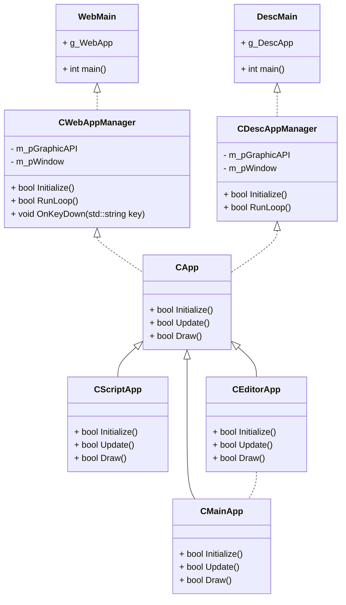

```mermaid
classDiagram
    class WebMain{
        + g_WebApp
        + int main()
    }
    
    class CWebAppManager{
        - m_pGraphicAPI
        - m_pWindow
        + bool Initialize()
        + bool RunLoop()
        + void OnKeyDown(std::string key)
    }
    
    WebMain <|.. CWebAppManager
    
    class DescMain{
        + g_DescApp
        + int main()
    }
    
    class CDescAppManager{
        - m_pGraphicAPI
        - m_pWindow
        + bool Initialize()
        + bool RunLoop()
    }
    
    DescMain <|.. CDescAppManager
    
    class CApp{
        + bool Initialize()
        + bool Update()
        + bool Draw()
    }
    
    CWebAppManager <|.. CApp
    CDescAppManager <|.. CApp
    
    class CScriptApp{
        + bool Initialize()
        + bool Update()
        + bool Draw()
    }
    
    CApp <|-- CScriptApp
    
    class CEditorApp{
        + bool Initialize()
        + bool Update()
        + bool Draw()
    }
    
    CApp <|-- CEditorApp
    
    class CMainApp{
        + bool Initialize()
        + bool Update()
        + bool Draw()
    }
    
    CApp <|-- CMainApp
    CEditorApp .. CMainApp
```
