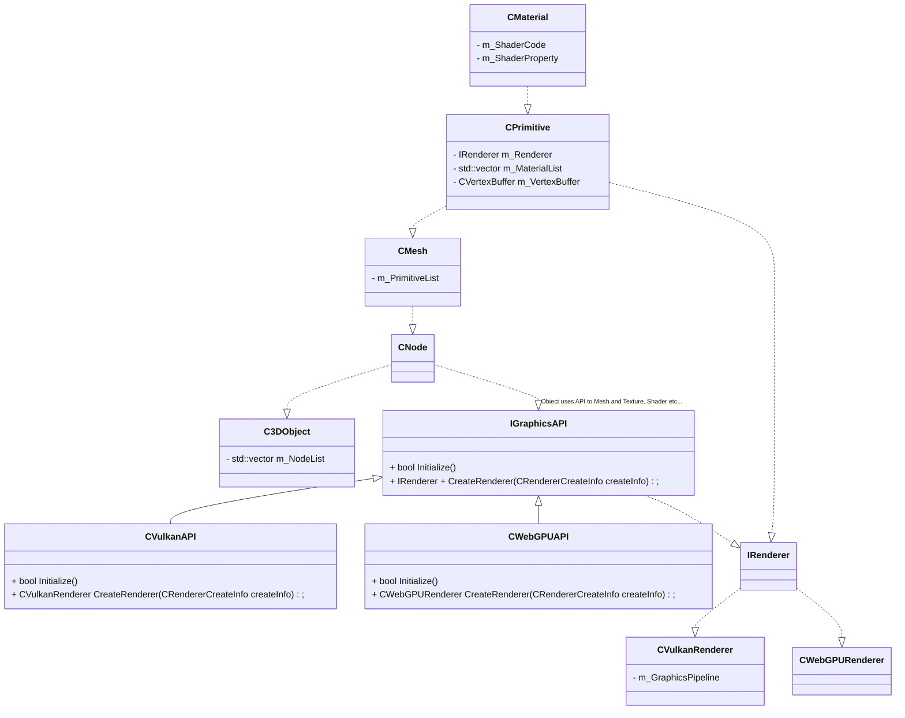

```mermaid
classDiagram
  class C3DObject{
    - std::vector<CNode> m_NodeList
  }

  class CNode{
  }
 
  CNode ..|> C3DObject
 
  class CMesh{
    - m_PrimitiveList
  }
  
  CMesh ..|> CNode
  
  class CPrimitive{
    - IRenderer m_Renderer
    - std::vector<CMaterial> m_MaterialList
    - CVertexBuffer m_VertexBuffer
  }

  CPrimitive ..|> CMesh
  
  class CMaterial{
    - m_ShaderCode
    - m_ShaderProperty
  }

  CMaterial ..|> CPrimitive
  
  class IGraphicsAPI{
    + bool Initialize()
    + IRenderer + CreateRenderer(CRendererCreateInfo createInfo);
  }
  
  CNode ..|> "Object uses API to Mesh and Texture, Shader etc..." IGraphicsAPI

  class CVulkanAPI{
    + bool Initialize()
    + CVulkanRenderer CreateRenderer(CRendererCreateInfo createInfo);
  }
  
  IGraphicsAPI <|-- CVulkanAPI
  
  class CWebGPUAPI{
    + bool Initialize()
    + CWebGPURenderer CreateRenderer(CRendererCreateInfo createInfo);
  }
  
  IGraphicsAPI <|-- CWebGPUAPI

  class IRenderer{
  
  }
  
  CPrimitive ..|> IRenderer
  IGraphicsAPI ..|> IRenderer
  
  class CVulkanRenderer{
    - m_GraphicsPipeline
  }
  
  IRenderer ..|> CVulkanRenderer
  
  class CWebGPURenderer{
  
  }
  
  IRenderer ..|> CWebGPURenderer

```
