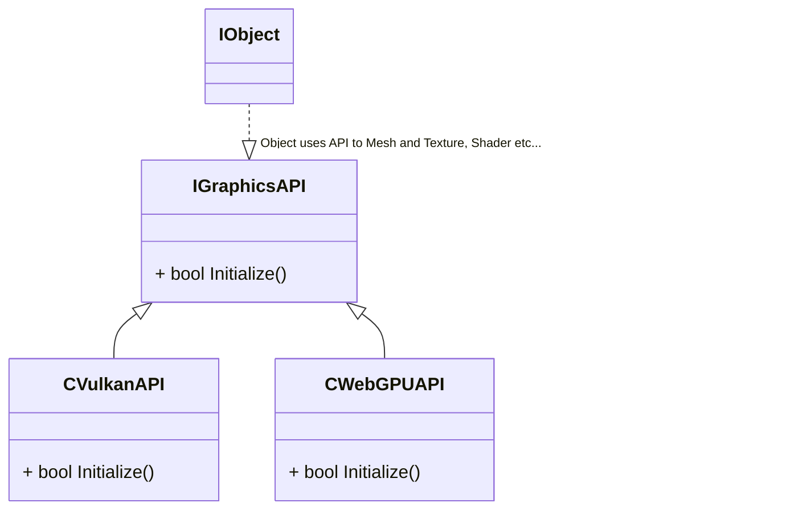

```mermaid
classDiagram
  class IObject{
  
  }

  class IGraphicsAPI{
    + bool Initialize()
  }
  
  IObject ..|> "Object uses API to Mesh and Texture, Shader etc..." IGraphicsAPI

  class CVulkanAPI{
    + bool Initialize()
  }
  
  IGraphicsAPI <|-- CVulkanAPI
  
  class CWebGPUAPI{
    + bool Initialize()
  }
  
  IGraphicsAPI <|-- CWebGPUAPI

```
