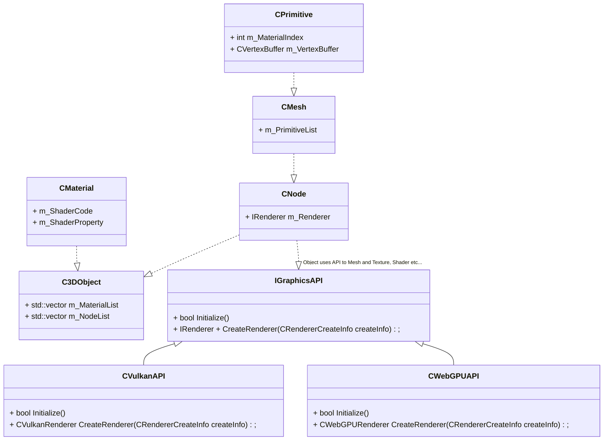

```mermaid
classDiagram
  class C3DObject{
    + std::vector<CMaterial> m_MaterialList
    + std::vector<CNode> m_NodeList
  }

  class CNode{
    + IRenderer m_Renderer
  }
 
  CNode ..|> C3DObject
 
  class CMaterial{
    + m_ShaderCode
    + m_ShaderProperty
  }

  CMaterial ..|> C3DObject

  class CMesh{
    + m_PrimitiveList
  }
  
  CMesh ..|> CNode
  
  class CPrimitive{
    + int m_MaterialIndex
    + CVertexBuffer m_VertexBuffer
  }

  CPrimitive ..|> CMesh

  class IGraphicsAPI{
    + bool Initialize()
    + IRenderer + CreateRenderer(CRendererCreateInfo createInfo);
  }
  
  CNode ..|> "Object uses API to Mesh and Texture, Shader etc..." IGraphicsAPI

  class CVulkanAPI{
    + bool Initialize()
    + CVulkanRenderer CreateRenderer(CRendererCreateInfo createInfo);
  }
  
  IGraphicsAPI <|-- CVulkanAPI
  
  class CWebGPUAPI{
    + bool Initialize()
    + CWebGPURenderer CreateRenderer(CRendererCreateInfo createInfo);
  }
  
  IGraphicsAPI <|-- CWebGPUAPI

```
