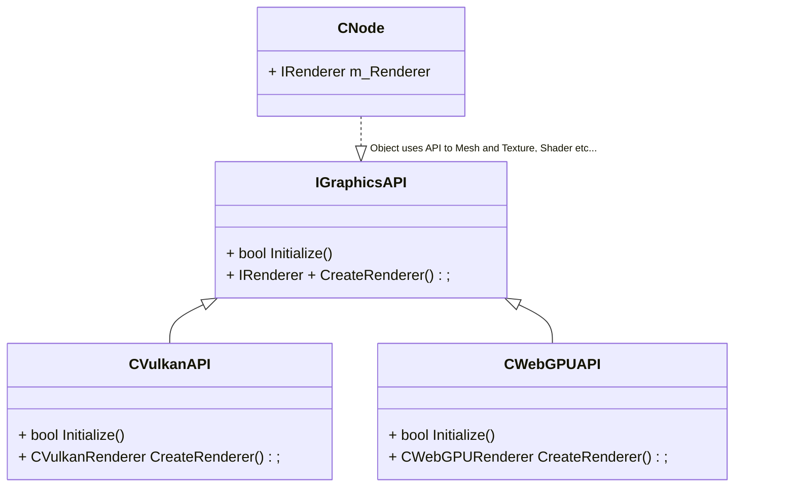

```mermaid
classDiagram
  class CNode{
    + IRenderer m_Renderer
  }

  class IGraphicsAPI{
    + bool Initialize()
    + IRenderer + CreateRenderer();
  }
  
  CNode ..|> "Object uses API to Mesh and Texture, Shader etc..." IGraphicsAPI

  class CVulkanAPI{
    + bool Initialize()
    + CVulkanRenderer CreateRenderer();
  }
  
  IGraphicsAPI <|-- CVulkanAPI
  
  class CWebGPUAPI{
    + bool Initialize()
    + CWebGPURenderer CreateRenderer();
  }
  
  IGraphicsAPI <|-- CWebGPUAPI

```
